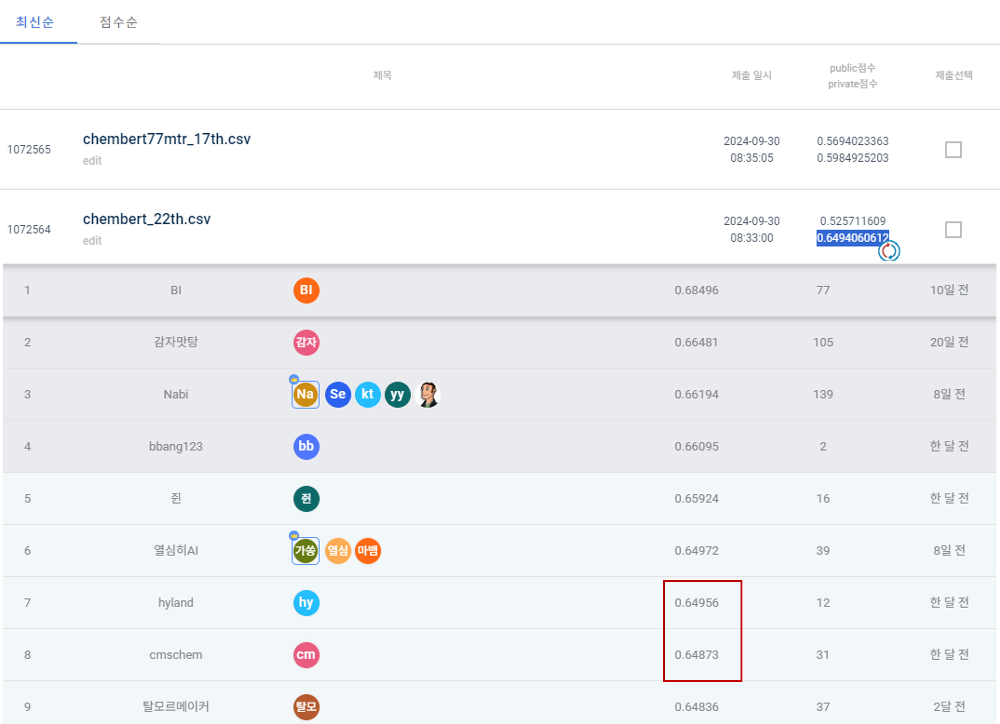

# JUMP_AI_2024
https://dacon.io/competitions/official/236336/overview/description

# 22th trial / 240923
- Chemberta-v1
- new train unique / test canonical
- loss function: **CUSTOM**
- relu (X)
- descriptor 10개
- batch 64 / learning rate 1e-6
- o1-preview
- epoch 1000

# Review
**프로젝트 개요**

- **참여 경진대회**: 제2회 신약개발 AI 경진대회 (DACON)
- **프로젝트 목표**: IRAK4(Interleukin-1 Receptor-Associated Kinase 4) 단백질의 IC50 활성 값을 예측하는 AI 모델 개발
- **예측 대상**: IC50 값은 약물의 특정 생물학적 기능을 50% 억제하는 데 필요한 농도를 의미하며, 이를 기반으로 약물의 효능을 평가
- **팀 구성**: 5명의 팀원과 함께 데이터 분석, 모델 개발, 선행 연구 조사 담당

**데이터 처리 및 모델 개발**

- **데이터 구성**:
    - SMILES 데이터로 분자 구조를 표현
    - 약물-단백질 상호작용을 나타내는 IC50 데이터
    - RDKit, Mordred 등을 사용하여 분자의 descriptors를 계산 (예: Molecule Weight, Hydrogen Bond Donors/Acceptors)
- **데이터 전처리**:
    - SMILES 데이터를 Canonical SMILES로 변환해 중복 제거
    - 중복된 IC50 값을 가진 데이터를 분석하여 적절한 값을 선택
- **모델 개발**:
    - ChemBERTa-77M-MTR 모델을 사용하여 약물의 화학 구조로부터 IC50 값을 예측
    - RobertaTokenizer와 ChemBERTa 모델의 fine-tuning을 통해 IC50 예측 성능 향상
    - 모델 학습 시 다양한 Hyperparameter 튜닝을 진행 (Learning Rate, Epoch 수, Early Stopping, Cross Validation 적용)
    - Fingerprint와 descriptors 기반의 특징 추출

**모델 학습 및 성능 평가**

- **학습 과정**:
    - 데이터셋을 8:2로 나누어 train/test 세트 구성
    - Epoch 500, Learning Rate 1e-5로 학습, Cross Validation을 통해 성능 확인
    - Early Stopping을 사용해 overfitting 방지
- **AutoML 적용**:
    - MLJar 및 TPOT을 사용하여 머신러닝 모델 비교
    - XGBoost와 LightGBM 등도 실험적으로 사용

**결과 및 성과**

- **리더보드 성적**:
    - Public 리더보드에서 RMSE 0.6297로 66위 기록
    - Private 리더보드에서는 RMSE 0.57172로 403위 기록
    - Public과 Private 리더보드 간 성능 차이를 경험하며 파일 제출 전략의 중요성 확인
- **최종 모델**:
    - ChemBERTa 기반 모델에서 분자 특성을 활용한 예측 성능이 우수하였으나, descriptor 추가 후 성능 개선의 한계가 있었음
    - 다양한 Descriptor 및 Feature Engineering을 통한 추가 개선 시도 진행

**프로젝트에서 배운 점**

- **Public vs Private 리더보드 성능 차이**: Private 리더보드가 최종 평가 기준이므로 모델 제출 전략 중요
- **약물 개발 도메인 지식**: 약물의 IC50 예측에서 중요한 Descriptor와 AI 모델의 활용법
- **데이터 과학적 접근**: Graph Convolutional Network(GCN) 등 다양한 모델링 방법론의 적용 가능성을 탐색, 최적의 loss function 탐구

**사용한 주요 도구 및 라이브러리**

- **Hugging Face**: ChemBERTa-77M-MTR 모델 및 토크나이저
- **RDKit & PaDEL**: 분자 descriptors 계산을 위한 주요 툴
- **AutoML**: MLJar, TPOT을 통한 모델 자동화 및 성능 비교
- **DeepChem**: ChemBERTa와 기타 딥러닝 프레임워크 연동

** Final Rank**

